<p align="center">
  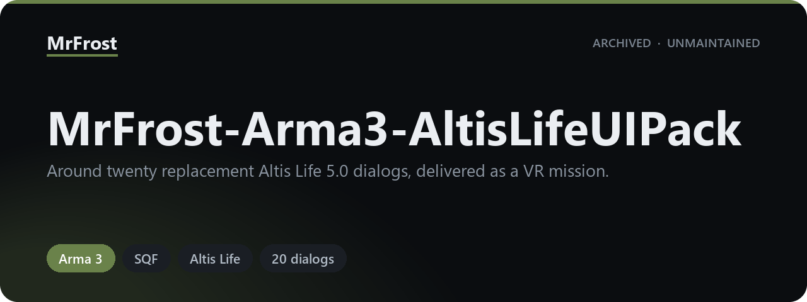
</p>

# Altis Life UI Pack — Arma 3

<p align="left">
  
  
  
  
  
  
  
  
</p>

Around twenty replacement Altis Life 5.0 dialogs, delivered as a VR mission you
open in the Eden editor. Full-screen redesigns of the ATM, the Z-menu, the
shops, the spawn selector, the trunk, the death screen and the rest.

Written in 2020–2021 by **MrFrost** as commissioned work — an *Auftragsarbeit*
for a project built around **Mammut-Roleplay.de**. The project never launched.
The pack was later released publicly on
[Native-Network](https://native-network.net) as a hard-drive cleanout.

> ### ⚠️ Archived · re-upload · unmaintained
>
> - Built for **Arma 3 / Altis Life 5.0 in 2020–2021**. It has not run since.
> - This is a **re-upload** of a release originally posted on Native-Network,
>   put here so it stops depending on a forum attachment staying online.
> - **Unmaintained.** No support, no fixes, no compatibility work. Pull requests
>   will not be merged. The original post already said as much:
>   *"Ich übernehme keinen Support für diesen Upload."*
> - **Nothing has been re-tested.** I no longer run an Arma 3 server and cannot
>   verify that any of this still works.
> - One dialog ships a **broken `idd`**, one dialog defines the same IDC twice,
>   and several dialogs share IDD numbers with each other and with stock Altis
>   Life. Read [docs/known-issues.md](docs/known-issues.md) before you copy
>   anything out of here.

---

## This is not a drop-in script

The other repositories in this series are scripts: copy the files in, add a few
lines to `description.ext`, and the feature works. **This one is not that.**

**There are no controller functions for these dialogs in this repository.** What
is here is layouts — `.hpp` control definitions and the textures they reference.
Nothing else.

The dialogs call stock Altis Life handlers by name — `life_fnc_weaponShopBuySell`,
`life_fnc_vehicleShopBuy`, `life_fnc_keyGive`, `life_fnc_cellphone` and so on.
Those handlers live in a full Altis Life 5.0 mission. They are not in this
repository, and nothing here will make them appear.

`src/Dialog.VR/dialog/function/` looks like it might be the missing half. It is
not. It holds twenty-four **stock** Altis Life functions, kept only so the
mission is readable in context. None of them were written for these layouts.

So the workflow is: open the mission in Eden, look at a dialog, and copy the
parts you want into your own Altis Life mission. Wiring them up is your job.
Every root class and every named IDC is listed in
[docs/dialog-reference.md](docs/dialog-reference.md) so you know what you are
copying.

---

---

## Preview

Screenshots taken in the VR test mission in 2020–2021, which is why every list
is filled with `Test Item` and every price is `123456`. The Mammut-Roleplay.de
logo visible in some of them is the original artwork; the repository itself
ships a transparent placeholder in its place — see
[THIRD-PARTY-NOTICES.md](THIRD-PARTY-NOTICES.md).

<table>
<tr>
<td width="33%">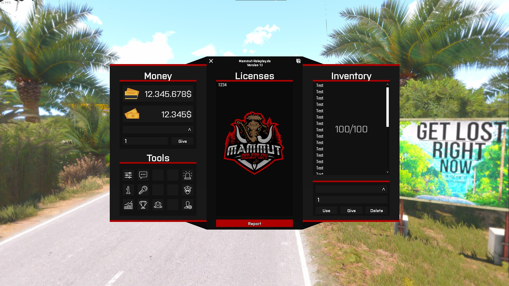<br><sub><code>player_inv.hpp</code> — inventory / Z-menu</sub></td>
<td width="33%">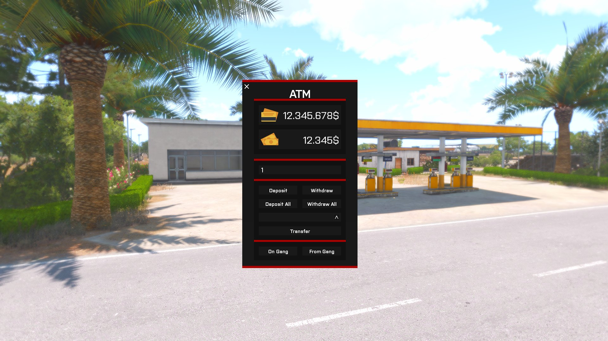<br><sub><code>bank.hpp</code> — ATM</sub></td>
<td width="33%">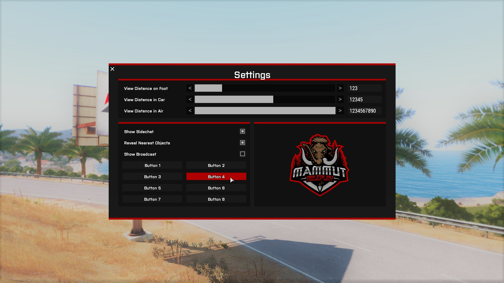<br><sub><code>settings.hpp</code> — settings</sub></td>
</tr>
<tr>
<td>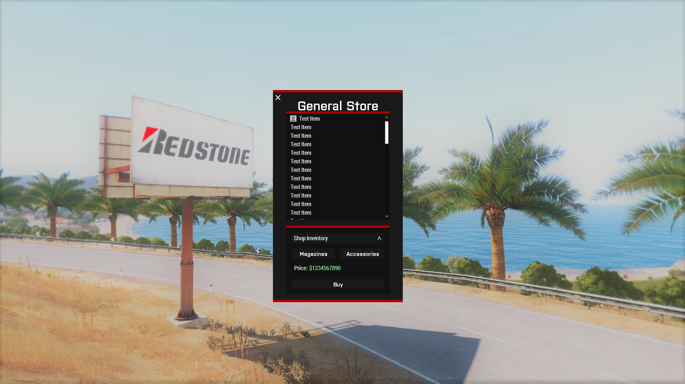<br><sub><code>shops.hpp</code> — weapon shop</sub></td>
<td>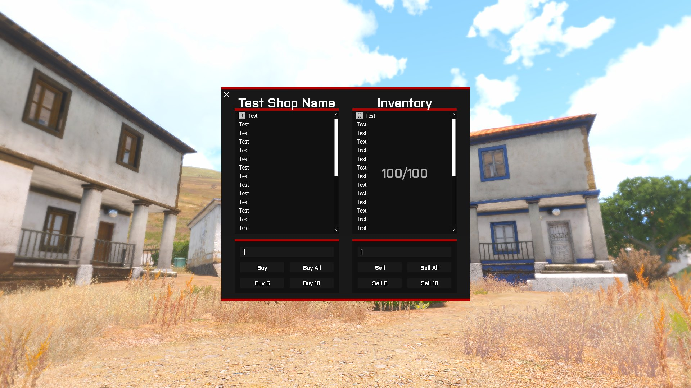<br><sub><code>shop_items.hpp</code> — virtual item shop</sub></td>
<td>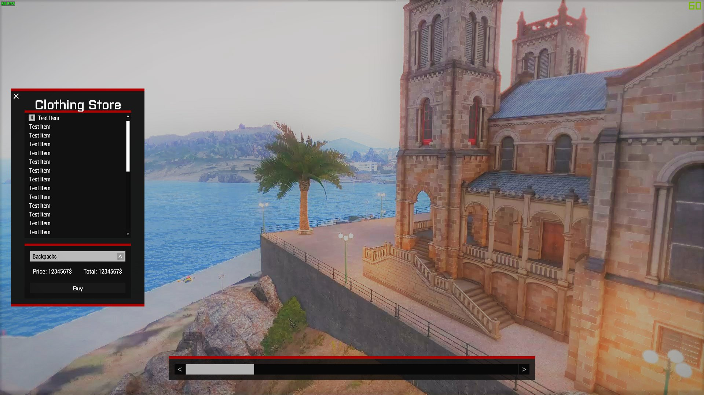<br><sub><code>clothing.hpp</code> — clothing store</sub></td>
</tr>
<tr>
<td>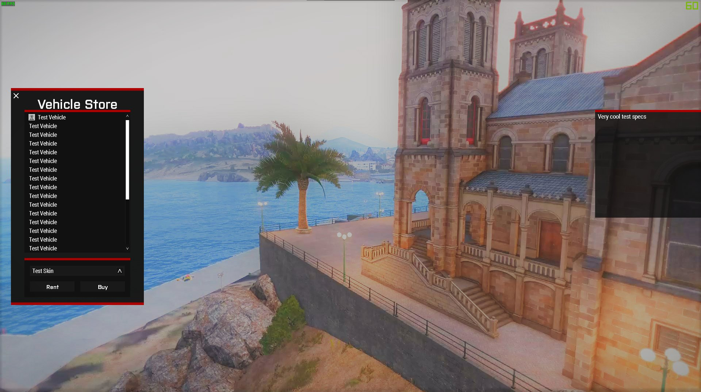<br><sub><code>vehicleShop3D.hpp</code> — vehicle shop</sub></td>
<td>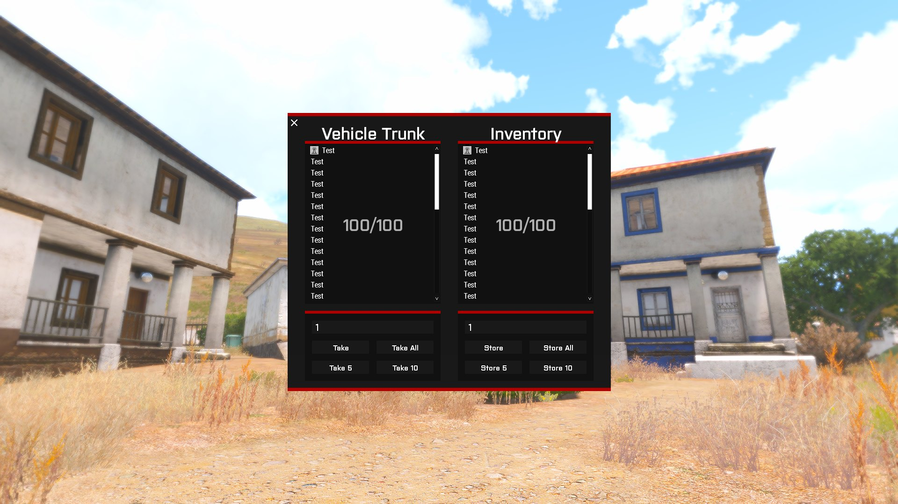<br><sub><code>trunk.hpp</code> — vehicle trunk</sub></td>
<td>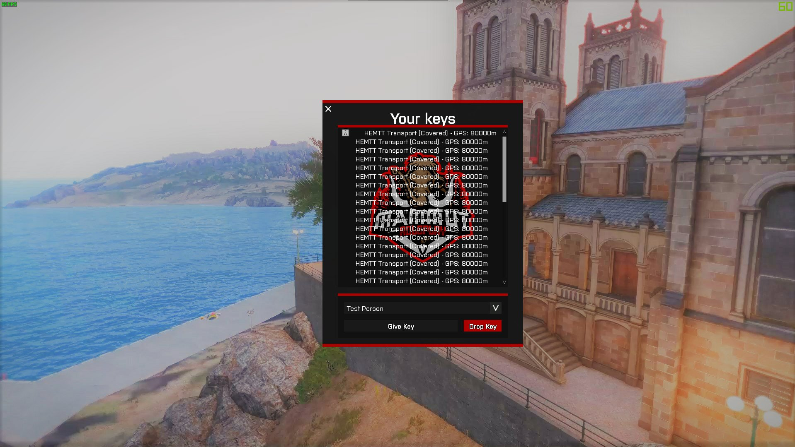<br><sub><code>key_chain.hpp</code> — key chain</sub></td>
</tr>
<tr>
<td>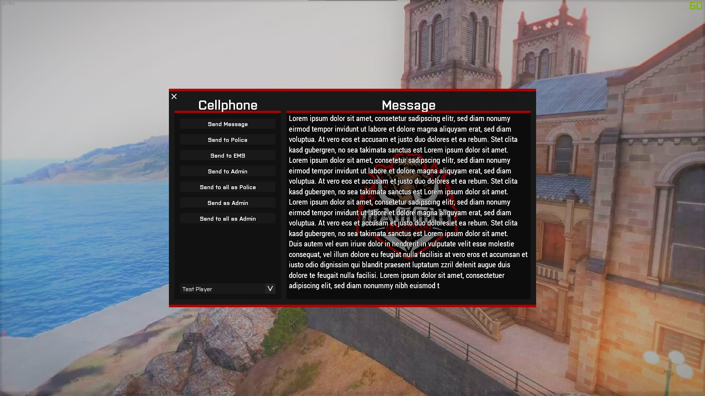<br><sub><code>cell_phone.hpp</code> — cell phone</sub></td>
<td>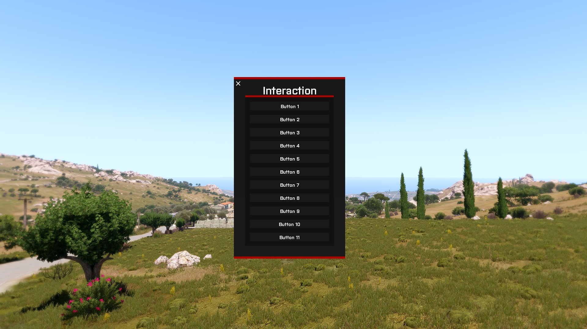<br><sub><code>pInteraction.hpp</code> — interaction menu</sub></td>
<td>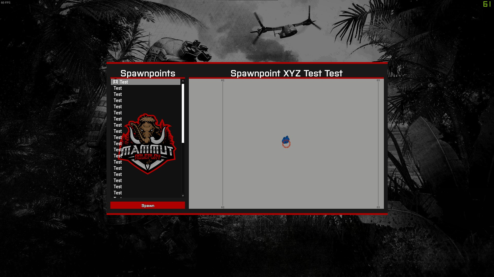<br><sub><code>spawnSelection.hpp</code> — spawn selection</sub></td>
</tr>
<tr>
<td>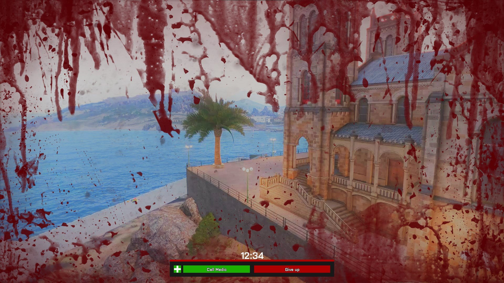<br><sub><code>deathScreen.hpp</code> — death screen</sub></td>
<td>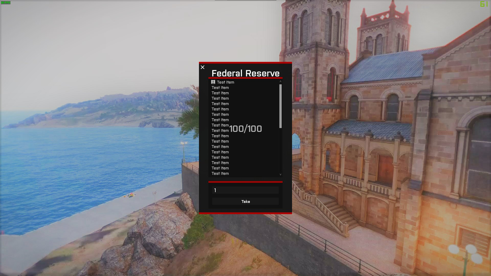<br><sub><code>federalReserve.hpp</code> — federal reserve</sub></td>
<td>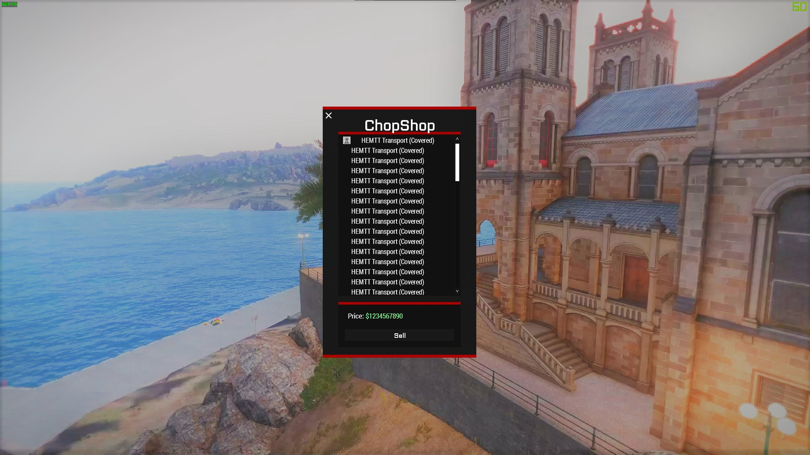<br><sub><code>chop_shop.hpp</code> — chop shop</sub></td>
</tr>
<tr>
<td>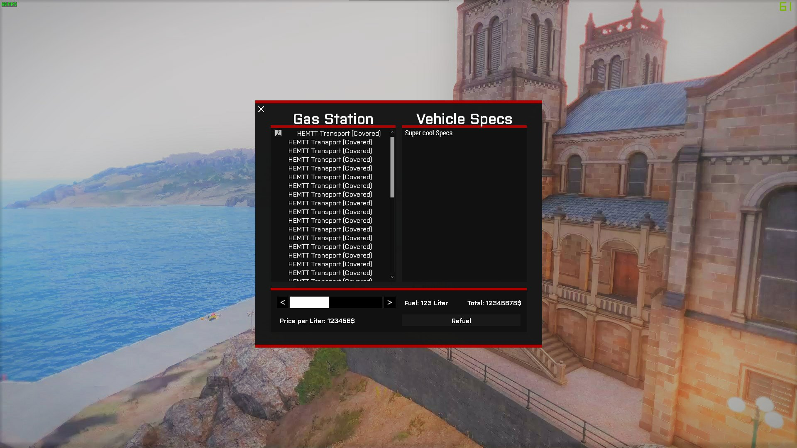<br><sub><code>FuelStat.hpp</code> — fuel station</sub></td>
<td>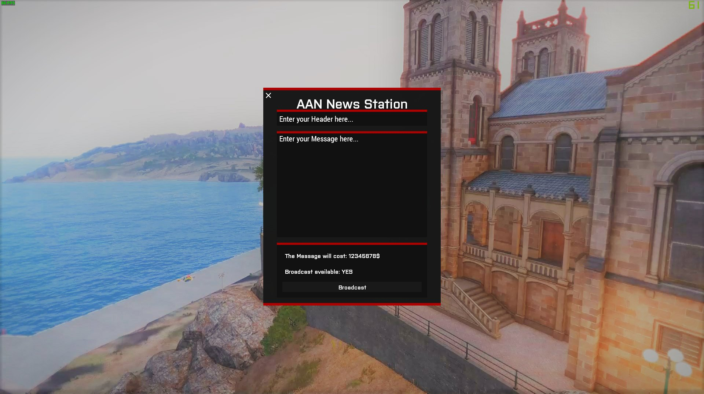<br><sub><code>newsStation.hpp</code> — news station</sub></td>
<td>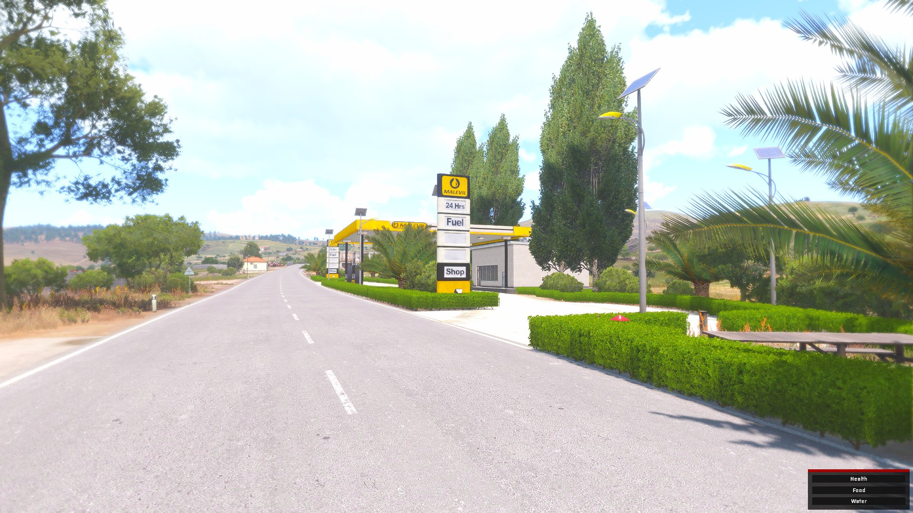<br><sub><code>hud_stats.hpp</code> — player HUD</sub></td>
</tr>
</table>

A second HUD revision is in [`assets/hud-stats-2.jpg`](assets/hud-stats-2.jpg).
`impound.hpp` and `progress.hpp` were never screenshotted.


## What's in the pack

Twenty dialog files by MrFrost. The IDD column is the resolved value of the
file's own `MrFrost_IDD_*` macro.

| File | Root class | IDD | What it is |
| --- | --- | --- | --- |
| `bank.hpp` | `Life_atm_management` | 2700 | ATM / bank management |
| `cell_phone.hpp` | `Life_cell_phone` | 3000 | Cell phone |
| `chop_shop.hpp` | `Chop_Shop` | 39400 | Chop shop |
| `clothing.hpp` | `Life_Clothing` | 3100 | Clothing store |
| `deathScreen.hpp` | `DeathScreen` | 7300 | Death screen overlay |
| `federalReserve.hpp` | `Federal_Safe` | 3500 | Federal reserve |
| `FuelStat.hpp` | `Life_FuelStat` | 20300 | Fuel station |
| `hud_stats.hpp` | `playerHUD` | -1 | Player HUD — an `RscTitles` resource, not a dialog |
| `impound.hpp` | `Life_impound_menu` | 2800 | Garage / impound |
| `key_chain.hpp` | `Life_key_management` | 2700 | Vehicle key chain |
| `newsStation.hpp` | `life_news_broadcast` | 100100 | News station broadcast |
| `pInteraction.hpp` | `pInteraction_Menu` | **broken** [^idd] | Player interaction menu |
| `pInteraction.hpp` | `vInteraction_Menu` | 37400 | Vehicle interaction menu |
| `player_inv.hpp` | `playerSettings` | 2001 | Player inventory / Z-menu |
| `progress.hpp` | `life_progress`, `life_timer` | 38200 | Progress bar and timer — both `RscTitles` resources |
| `settings.hpp` | `SettingsMenu` | 2900 | Settings menu |
| `shop_items.hpp` | `shops_menu` | 2400 | Virtual item shop |
| `shops.hpp` | `life_weapon_shop` | 38400 | Weapon shop |
| `spawnSelection.hpp` | `life_spawn_selection` | 38500 | Spawn point selection |
| `trunk.hpp` | `TrunkMenu` | 3500 | Vehicle trunk |
| `vehicleShop3D.hpp` | `Life_Vehicle_Shop_v2_3D` | 2300 | Vehicle shop with 3D preview |

[^idd]: `pInteraction.hpp` sets `idd = MrFrost_IDD_Interaction;`, and that macro
is defined nowhere in the project. The Arma preprocessor passes the unknown
identifier straight through, so `pInteraction_Menu` ends up with a non-numeric
`idd`. See [docs/known-issues.md](docs/known-issues.md).

Several of those IDDs collide — 2700 twice, 3500 twice, and 2300, 2400 and 2900
each clash with a stock Altis Life dialog. That is legal in Arma as long as the
two are never open at the same time, but it does make `findDisplay` ambiguous if
they are. The full list is in [docs/known-issues.md](docs/known-issues.md).

### Also included

The mission also carries a set of **stock Altis Life files by
Bryan "Tonic" Boardwine**, untouched and byte-identical to the framework:

- ten stock dialogs — `admin_menu`, `common`, `compensate`, `emp_menu`, `gang`,
  `hud_nameTags`, `ticket`, `veh_shop`, `vehicleShop`, `wanted_list`
- all twenty-four files in `dialog/function/`
- `script_macros.hpp`, `dialog/player_sys.sqf`, `mission.sqm`, `description.ext`

They are here for one reason: the MrFrost dialogs inherit from `common.hpp` and
the mission will not preprocess without them, so without these files the pack
does not open in Eden at all. They are not part of what was authored here. See
[THIRD-PARTY-NOTICES.md](THIRD-PARTY-NOTICES.md).

## Requirements

- **Arma 3**, and the **Eden editor** to open `src/Dialog.VR` — the mission is
  on the VR terrain.
- **Altis Life 5.0** if you want the dialogs to actually do anything. Without a
  full life mission behind them they are drawings: they open, they render, and
  every button calls a function that does not exist.

---

## Layout

```
src/Dialog.VR/
├── description.ext                    stock — pulls in dialog/MasterHandler.hpp
├── init.sqf                           empty (0 bytes)
├── mission.sqm                        the VR mission Eden opens (stock)
├── script_macros.hpp                  stock
├── test.sqf                           unfinished scratch file, referenced by nothing
├── dialog/
│   ├── FuelStat.hpp                   MrFrost
│   ├── MasterHandler.hpp              the include list — everything below, in order
│   ├── MrFrost_defines.hpp            GUI defines and MrFrost_POSITION (Heyoxe)
│   ├── admin_menu.hpp                 stock
│   ├── bank.hpp                       MrFrost
│   ├── cell_phone.hpp                 MrFrost
│   ├── chop_shop.hpp                  MrFrost
│   ├── clothing.hpp                   MrFrost
│   ├── common.hpp                     stock — control base classes
│   ├── compensate.hpp                 stock
│   ├── deathScreen.hpp                MrFrost
│   ├── emp_menu.hpp                   stock
│   ├── federalReserve.hpp             MrFrost
│   ├── function/                      24 stock Altis Life functions
│   ├── gang.hpp                       stock
│   ├── hud_nameTags.hpp               stock
│   ├── hud_stats.hpp                  MrFrost
│   ├── impound.hpp                    MrFrost
│   ├── key_chain.hpp                  MrFrost
│   ├── newsStation.hpp                MrFrost
│   ├── pInteraction.hpp               MrFrost — two displays in one file
│   ├── player_inv.hpp                 MrFrost
│   ├── player_sys.sqf                 stock — this is where IDD 2001 comes from
│   ├── progress.hpp                   MrFrost
│   ├── settings.hpp                   MrFrost
│   ├── shop_items.hpp                 MrFrost
│   ├── shops.hpp                      MrFrost
│   ├── spawnSelection.hpp             MrFrost
│   ├── ticket.hpp                     stock
│   ├── trunk.hpp                      MrFrost
│   ├── veh_shop.hpp                   stock
│   ├── vehicleShop.hpp                stock
│   ├── vehicleShop3D.hpp              MrFrost
│   └── wanted_list.hpp                stock
└── pictures/
    └── GUI/                           16 textures — see the README in there
```

## Documentation

| Page | What it covers |
| --- | --- |
| [Installation](docs/installation.md) | Opening the mission, and lifting a dialog out of it |
| [Dialog reference](docs/dialog-reference.md) | Every dialog: root class, IDD, named IDCs |
| [Known issues](docs/known-issues.md) | Every defect I found while archiving this |
| [Original forum post](docs/original-post.de.md) | The German release post, archived |

---

## What changed for this re-upload

The rule: **do not change behaviour I cannot test.**

- Added a documentation header to each of the twenty MrFrost dialogs, inserted
  after the original 2021 legal header, which is untouched.
- Normalised line endings to LF, stripped trailing whitespace, added final
  newlines — on MrFrost-authored files only. Verified mechanically that the
  non-whitespace content of every touched file is byte-identical to the
  original.
- Wrote `docs/` from scratch.
- Replaced `Logo_Mammut.paa` with a transparent 1024 × 1024 DXT5 placeholder of
  the same format. The pack was commissioned work and the logo was never mine.
  See [`src/Dialog.VR/pictures/GUI/`](src/Dialog.VR/pictures/GUI/).
- Moved the original German release post out of `src/` — it was `Beitrag.txt`
  and is now [docs/original-post.de.md](docs/original-post.de.md).
- **No SQF or config logic was touched.** Not the undefined `idd`, not the
  duplicate IDC, not the two copy-paste leftovers in `onLoad`. All of it is
  documented instead.
- **No third-party file was touched at all** — not the stock Altis Life files,
  not Heyoxe's defines.

## Credits

- **[MrFrost](https://github.com/MrFrostDev)** — the twenty dialogs
- **[Heyoxe](https://steamcommunity.com/id/Heyoxe/)** — `MrFrost_defines.hpp`,
  the GUI defines and the `MrFrost_POSITION` macro
- **Bryan "Tonic" Boardwine** — the Altis Life RPG framework, and every stock
  file in this mission

See [THIRD-PARTY-NOTICES.md](THIRD-PARTY-NOTICES.md).

## Terms

The 2021 headers in these files forbid republishing under a different name and
forbid commercial use. They are preserved and still say that. To be
unambiguous: **I am the author and this is my own re-publication of my own
work.**

See [LICENSE](LICENSE) for the terms in full. It grants free use and
modification in your own missions, including on servers that take donations,
and it keeps what the 2021 headers already said: leave the author headers
intact, do not re-upload it elsewhere under another name, and do not sell it.

The stock Altis Life files remain under the framework's own terms.
`MrFrost_defines.hpp` is Heyoxe's work and is not mine to license.

If you hold rights to something here and would rather it were not published,
open an issue and it comes down.
